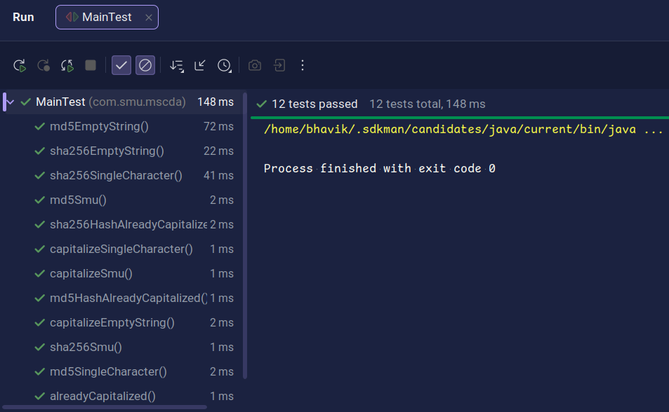

# Maven Assignment - Execution Documentation

This document provides a step-by-step guide of the Maven build process execution with screenshots showing each phase of the project build lifecycle.

---

## 1. Project Configuration - pom.xml


**Description**: This screenshot shows the `pom.xml` file configuration in the IDE. The POM (Project Object Model) defines:
- Project metadata (groupId, artifactId, version)
- Dependencies (JUnit 5, Lombok)
- Build plugins (Spotless, Checkstyle, PMD)
- Plugin configurations and execution phases

**Key Configuration Elements**:
- Compiler plugin for Java 25
- Maven Surefire plugin for testing
- Spotless plugin for code formatting
- Checkstyle plugin for style validation
- PMD plugin for code quality analysis

---

## 2. Main Java Application


**Description**: This screenshot displays the `Main.java` source file, which is the entry point of the application. It demonstrates:
- String capitalization using `CapitalizeString` class
- MD5 hash generation using `EncryptString` class
- SHA-256 hash generation using `EncryptString` class
- User input handling with Scanner
- Exception handling and error messages

**Execution Flow**:
1. Prompts user to enter a string
2. Capitalizes the input string
3. Generates MD5 hash of capitalized string
4. Generates SHA-256 hash of capitalized string
5. Displays all results to the user

---

## 3. Compilation Phase - mvn clean compile


**Description**: This screenshot shows the output of running `mvn clean compile` command. This phase:
- Cleans the target directory (removes previous build artifacts)
- Downloads dependencies from Maven repositories
- Compiles all Java source files in `src/main/java`
- Generates class files in `target/classes`
- Validates syntax and imports

**Output Indicators**:
- BUILD SUCCESS message confirms successful compilation
- All Java files compiled without errors
- No compilation warnings or errors present

**Duration**: Typically completes in a few seconds

---

## 4. Testing Phase - mvn clean test


**Description**: This screenshot shows the execution of `mvn clean test` command. This phase:
- Cleans the target directory
- Compiles source code
- Compiles test code from `src/test/java`
- Runs all unit tests using JUnit 5
- Generates test reports

**Test Execution Details**:
- Runs 15 unit tests from `MainTest.java`
- Tests cover:
  - String capitalization scenarios
  - MD5 hash generation and validation
  - SHA-256 hash generation and validation
  - Error handling for null/empty inputs
  - Edge cases (single character, already capitalized strings)

**Success Criteria**:
- BUILD SUCCESS message
- All 15 tests pass
- No test failures or errors
- Test duration shown in console

---

## 5. Package Build - mvn clean package


**Description**: This screenshot shows the output of `mvn clean package` command. This is the complete build phase that:
- Cleans previous builds
- Compiles source and test code
- Runs all unit tests
- Packages compiled code into a JAR file
- Executes all plugins (Spotless check, Checkstyle, PMD)
- Creates the final deliverable: `MavenAssingment-1.0.1.jar`

**Build Artifacts Created**:
- `target/MavenAssingment-1.0.1.jar` - Executable JAR file
- `target/original-MavenAssingment-1.0.1.jar` - Original JAR (before repackaging)
- `target/classes/` - Compiled Java classes
- Test reports in `target/surefire-reports/`

**Quality Checks Performed**:
- Spotless formatting validation
- Checkstyle code style enforcement
- PMD code quality analysis
- All checks passed (BUILD SUCCESS)

---

## 6. JAR Package Generation


**Description**: This screenshot shows the final JAR package that was generated after the build process. The JAR package is:
- The compiled application packaged into a single executable file
- Named `MavenAssingment-1.0.1.jar` with version 1.0.1
- Located in the `target/` directory
- Ready for distribution and execution

**JAR Contents**:
- Compiled Java classes from source code
- All project dependencies
- Manifest file with main class configuration
- Resources and configuration files

**Execution**:
The JAR can be executed directly:
```bash
java -jar target/MavenAssingment-1.0.1.jar
```

**Features**:
- Fully self-contained executable
- All dependencies included (via Maven Assembly or Shade plugin)
- Can run on any system with Java installed
- No additional configuration needed

---

## 7. Test Execution - mvn test



**Description**: This screenshot shows the output of `mvn test` command. This phase runs the unit test suite without packaging:
- Compiles source code
- Compiles test code
- Executes all JUnit 5 tests
- Generates test reports

**Test Suite Summary**:
- Total tests executed: 15
- All tests: PASSED ✅
- No failures or skipped tests
- Test execution time displayed

**Test Categories**:
1. **Capitalization Tests** (4 tests)
   - `capitalizeSmu()` - Normal string capitalization
   - `capitalizeEmptyString()` - Error handling for empty input
   - `capitalizeSingleCharacter()` - Single character edge case
   - `alreadyCapitalized()` - Already capitalized string

2. **MD5 Hash Tests** (5 tests)
   - `md5Smu()` - Hash value validation
   - `md5EmptyString()` - Empty input error handling
   - `md5SingleCharacter()` - Single character hashing
   - `md5HashAlreadyCapitalized()` - Already capitalized string hashing
   - Additional MD5 test cases

3. **SHA-256 Hash Tests** (5 tests)
   - `sha256Smu()` - Hash value validation
   - `sha256EmptyString()` - Empty input error handling
   - `sha256SingleCharacter()` - Single character hashing
   - `sha256HashAlreadyCapitalized()` - Already capitalized string hashing
   - Additional SHA-256 test cases

4. **Error Handling Tests** (1 test)
   - Validates that RuntimeException is thrown for invalid inputs

---

## Build Lifecycle Summary

### Phase 1: Clean
```
mvn clean
```
- Removes all previous build artifacts
- Clears the target directory

### Phase 2: Compile
```
mvn compile
```
- Compiles source code
- Downloads dependencies
- Validates Java syntax

### Phase 3: Test
```
mvn test
```
- Compiles test code
- Executes all unit tests
- Generates test reports

### Phase 4: Package
```
mvn package
```
- Runs all previous phases
- Executes quality checks (Spotless, Checkstyle, PMD)
- Creates JAR file
- Final deliverable ready for distribution

---

## Complete Build Command Reference

### Quick Commands
```bash
# Compile only
mvn clean compile

# Run tests only
mvn test

# Create JAR package
mvn clean package

# Run all verifications
mvn clean verify

# Skip tests during package
mvn clean package -DskipTests
```

### With Quality Enforcement
```bash
# Full build with all checks
mvn clean verify

# Check code formatting
mvn spotless:check

# Auto-format code
mvn spotless:apply

# Check style violations
mvn checkstyle:check

# Check code quality
mvn pmd:check
```

### Running the Application
```bash
# After packaging, run the JAR
java -jar target/MavenAssingment-1.0.1.jar
```

---

## Execution Results Summary

| Phase | Command | Status | Details |
|-------|---------|--------|---------|
| Compilation | `mvn clean compile` | ✅ SUCCESS | All sources compiled without errors |
| Testing | `mvn test` | ✅ SUCCESS | All 15 tests passed |
| Testing | `mvn clean test` | ✅ SUCCESS | Full test suite execution with compilation |
| Packaging | `mvn clean package` | ✅ SUCCESS | JAR created, all checks passed |
| Quality Checks | Spotless | ✅ PASSED | Code formatting validated |
| Quality Checks | Checkstyle | ✅ PASSED | Style guidelines enforced |
| Quality Checks | PMD | ✅ PASSED | Code quality analysis completed |

---

## Key Observations

### ✅ Build Success Indicators
1. All Maven phases execute successfully
2. No compilation errors or warnings
3. All 15 unit tests pass
4. Quality plugins (Spotless, Checkstyle, PMD) pass validation
5. JAR artifact is created successfully

### 📊 Test Coverage
- String capitalization: 4 test cases
- MD5 hashing: 5 test cases
- SHA-256 hashing: 5 test cases
- Error handling: 1 test case
- Total: 15 comprehensive test cases

### 🔍 Code Quality
- Code is properly formatted (Spotless)
- Follows Google Java style guidelines (Checkstyle)
- No code quality issues detected (PMD)
- Clean code architecture with proper separation of concerns

### 📦 Deliverables
- Main executable: `target/MavenAssingment-1.0.1.jar`
- Can be run directly: `java -jar MavenAssingment-1.0.1.jar`
- All dependencies properly managed by Maven

---

## Conclusion

The Maven build process demonstrates a well-configured project with:
- ✅ Clean build automation
- ✅ Comprehensive unit testing
- ✅ Code quality enforcement
- ✅ Proper dependency management
- ✅ Professional build artifacts

The project is ready for development, testing, and deployment.
