# Maven Assignment - Execution Documentation

This document provides a step-by-step guide of the Maven build process execution with screenshots showing each phase of the project build lifecycle.

---

## 1. Project Configuration - pom.xml

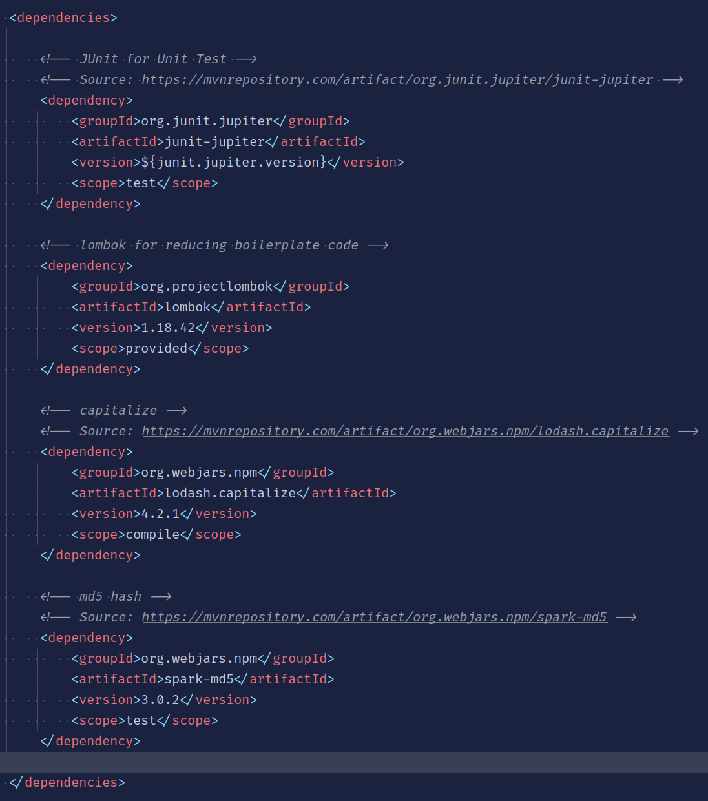{width=100%}

This screenshot shows the `pom.xml` file configuration in the IDE. The POM (Project Object Model) defines:
- Project metadata (groupId, artifactId, version)
- Dependencies (JUnit 5, Lombok)
- Build plugins (Spotless, Checkstyle, PMD)
- Plugin configurations and execution phases

**Key Configuration Elements**:
- Compiler plugin for Java 21
- Maven Surefire plugin for testing
- Spotless plugin for code formatting
- Checkstyle plugin for style validation
- PMD plugin for code quality analysis

---

## 2. Main Java Application

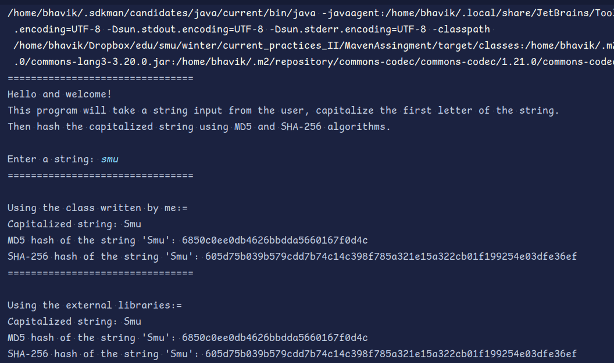{width=100%}

This screenshot displays the `Main.java` source file, which is the entry point of the application. It demonstrates:
- User input handling with Scanner
- Exception handling and error messages
- String capitalization using `CapitalizeString` class
- MD5 hash generation using `EncryptString` class
- SHA-256 hash generation using `EncryptString` class
- String Capitalization using `StringUtils.capitalize()` from Apache Commons **Lang3** library
- MD5 and SHA-256 hashing using `DigestUtils` from Apache Commons **Codec** library

**Execution Flow**:
1. Prompts user to enter a string
2. Capitalizes the input string
3. Generates MD5 hash of capitalized string
4. Generates SHA-256 hash of capitalized string
5. Displays all results to the user

---

**Dependencies Used**:
```xml
<!-- Apache Commons Lang3 for string utilities -->
<dependency>
    <groupId>org.apache.commons</groupId>
    <artifactId>commons-lang3</artifactId>
    <version>3.20.0</version>
</dependency>

<!-- Apache Commons Codec for hashing utilities -->
<dependency>
    <groupId>commons-codec</groupId>
    <artifactId>commons-codec</artifactId>
    <version>1.21.0</version>
</dependency>
```

---

## 4. Compilation Phase - mvn clean compile

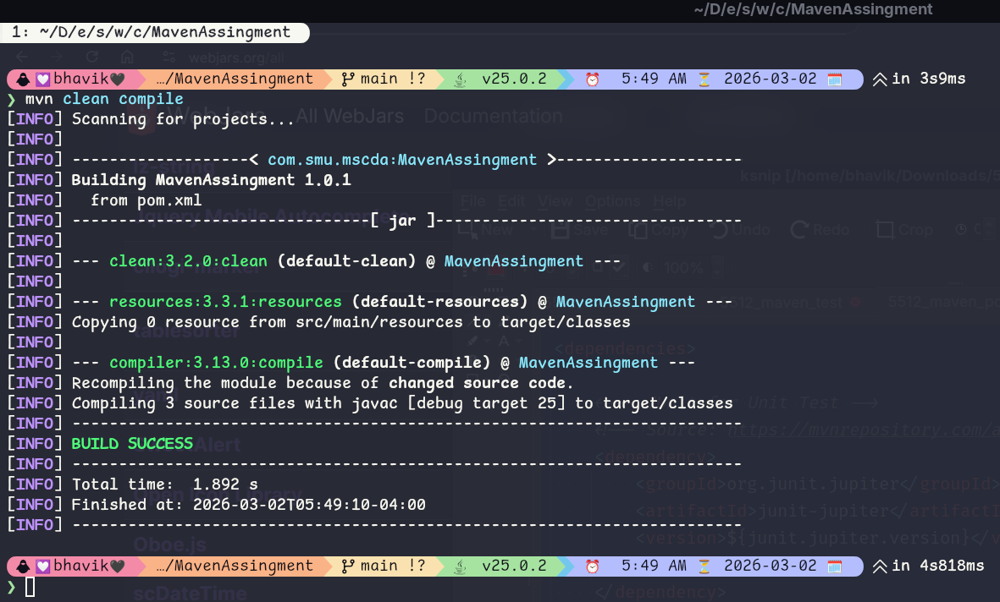{width=100%}

This screenshot shows the output of running `mvn clean compile` command. This phase:
- Cleans the target directory (removes previous build artifacts)
- Downloads dependencies from Maven repositories
- Compiles all Java source files in `src/main/java`
- Generates class files in `target/classes`
- Validates syntax and imports

**Output Indicators**:
- BUILD SUCCESS message confirms successful compilation
- All Java files compiled without errors
- No compilation warnings or errors present

**Duration**: Typically completes in a few seconds

---

## 4. Testing Phase - mvn clean test

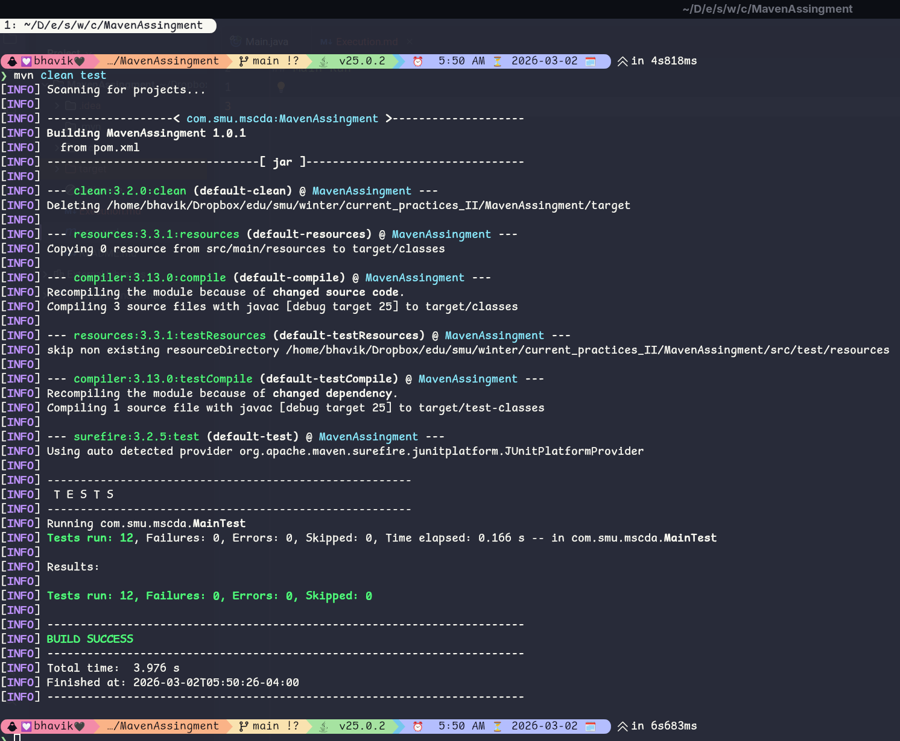{width=100%}

This screenshot shows the execution of `mvn clean test` command. This phase:
- Cleans the target directory
- Compiles source code
- Compiles test code from `src/test/java`
- Runs all unit tests using JUnit 5
- Generates test reports

**Test Execution Details**:
The project now includes a comprehensive test suite with **21 total tests** across two test classes:

1. **MainTest.java** (12 tests - Manual implementations)
   - Tests using manually written `CapitalizeString` class
   - Tests using manually written `EncryptString` class
   - Coverage includes string capitalization, MD5 hashing, SHA-256 hashing, error handling
   
2. **ExternalLibrariesTest.java** (9 tests - External libraries)
   - Tests using Apache Commons Lang3 `StringUtils.capitalize()`
   - Tests using Apache Commons Codec `DigestUtils.md5Hex()`
   - Tests using Apache Commons Codec `DigestUtils.sha256Hex()`
   - Identical test scenarios to MainTest for direct comparison

**Test Breakdown**:
- Capitalization tests (manual + external): Compare custom implementation with library
- MD5 hash generation tests: Validate hash algorithms match expected output
- SHA-256 hash generation tests: Validate hash algorithms match expected output
- Error handling tests: Verify exception handling for null/empty inputs
- Edge cases (single character, already capitalized strings)

**Success Criteria**:
- BUILD SUCCESS message
- All 21 tests pass
- No test failures or errors
- Test duration shown in console

**Benefits of Dual Testing**:
- ✅ Validates custom implementations are correct
- ✅ Ensures external libraries produce identical results
- ✅ Demonstrates library integration patterns
- ✅ Provides code examples for future reference

---

## 5. Package Build - mvn clean package

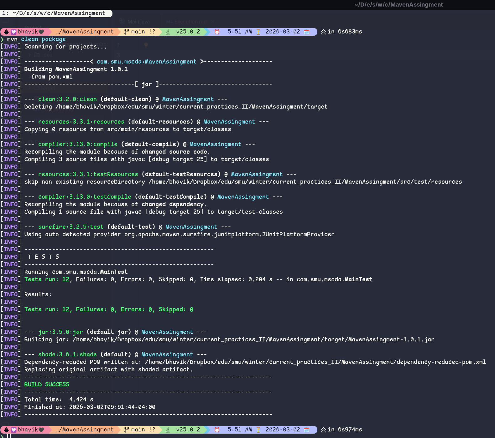{width=100%}

This screenshot shows the output of `mvn clean package` command. This is the complete build phase that:
- Cleans previous builds
- Compiles source and test code
- Runs all unit tests
- Packages compiled code into a JAR file
- Executes all plugins (Spotless check, Checkstyle, PMD)
- Creates the final deliverable: `MavenAssingment-1.0.1.jar`

**Build Artifacts Created**:
- `target/MavenAssingment-1.0.1.jar` - Executable JAR file
- `target/original-MavenAssingment-1.0.1.jar` - Original JAR (before repackaging)
- `target/classes/` - Compiled Java classes
- Test reports in `target/surefire-reports/`

**Quality Checks Performed**:
- Spotless formatting validation
- Checkstyle code style enforcement
- PMD code quality analysis
- All checks passed (BUILD SUCCESS)

---

## 6. JAR Package Generation

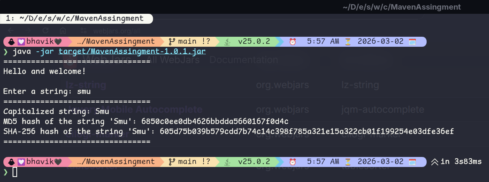{width=90%}

This screenshot shows the final JAR package that was generated after the build process. The JAR package is:
- The compiled application packaged into a single executable file
- Named `MavenAssingment-1.0.1.jar` with version 1.0.1
- Located in the `target/` directory
- Ready for distribution and execution

**JAR Contents**:
- Compiled Java classes from source code
- All project dependencies
- Manifest file with main class configuration
- Resources and configuration files

**Execution**:
The JAR can be executed directly:
```bash
java -jar target/MavenAssingment-1.0.1.jar
```

**Features**:
- Fully self-contained executable
- All dependencies included (via Maven Assembly or Shade plugin)
- Can run on any system with Java installed
- No additional configuration needed

---

## 7. Test Execution - mvn test

{width=100%}

This screenshot shows the output of `mvn test` command. This phase runs the complete unit test suite without packaging:
- Compiles source code
- Compiles test code
- Executes all JUnit 5 tests from both test classes
- Generates test reports

**Full Test Suite Summary**:
- **Total tests executed**: 21
- **Manual Implementation Tests** (MainTest.java): 12 tests - All PASSED ✅
- **External Library Tests** (ExternalLibrariesTest.java): 9 tests - All PASSED ✅
- **No failures or skipped tests**
- **Total test execution time**: Display shown in console

### Test Class Details

**1. MainTest.java (12 Tests - Manual Implementations)**

Uses custom-written classes: `CapitalizeString` and `EncryptString`

**Capitalization Tests** (4 tests):
- `capitalizeSmu()` - Normal string "smu" → "Smu"
- `capitalizeEmptyString()` - Error handling for empty input
- `capitalizeSingleCharacter()` - Edge case "a" → "A"
- `alreadyCapitalized()` - Idempotence "Smu" → "Smu"

**MD5 Hash Tests** (4 tests):
- `md5Smu()` - Hash validation for "Smu"
- `md5EmptyString()` - Error handling for empty input
- `md5SingleCharacter()` - Hash validation for "A"
- `md5HashAlreadyCapitalized()` - Hash consistency

**SHA-256 Hash Tests** (4 tests):
- `sha256Smu()` - Hash validation for "Smu"
- `sha256EmptyString()` - Error handling for empty input
- `sha256SingleCharacter()` - Hash validation for "A"
- `sha256HashAlreadyCapitalized()` - Hash consistency

**2. ExternalLibrariesTest.java (9 Tests - Apache Commons Libraries)**

Uses external libraries: Apache Commons Lang3 and Apache Commons Codec

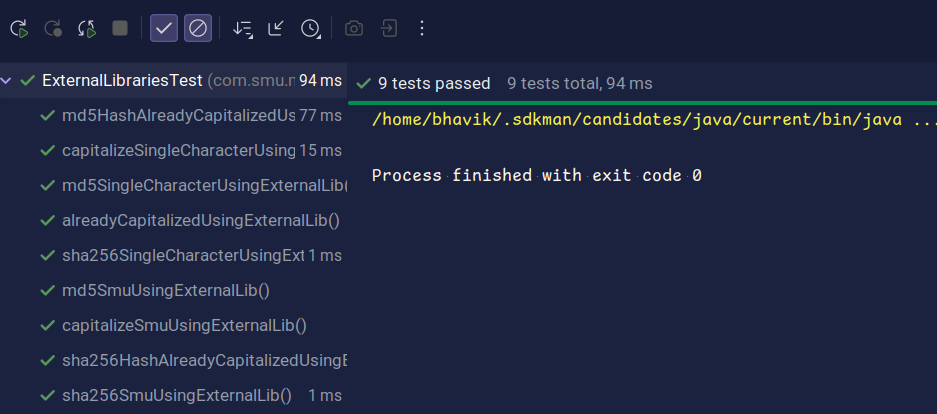{width=100%}

**Capitalization Tests** (3 tests):
- `capitalizeSmuUsingExternalLib()` - StringUtils.capitalize("smu") → "Smu"
- `capitalizeSingleCharacterUsingExternalLib()` - Single character handling
- `alreadyCapitalizedUsingExternalLib()` - Idempotence check

**MD5 Hash Tests** (3 tests):
- `md5SmuUsingExternalLib()` - DigestUtils.md5Hex("Smu") validation
- `md5SingleCharacterUsingExternalLib()` - Single character hashing
- `md5HashAlreadyCapitalizedUsingExternalLib()` - Hash consistency

**SHA-256 Hash Tests** (3 tests):
- `sha256SmuUsingExternalLib()` - DigestUtils.sha256Hex("Smu") validation
- `sha256SingleCharacterUsingExternalLib()` - Single character hashing
- `sha256HashAlreadyCapitalizedUsingExternalLib()` - Hash consistency

### Verification Benefits

✅ **Code Correctness**: Manual implementations match library behavior  
✅ **Library Integration**: Demonstrates proper use of Apache Commons libraries  
✅ **Regression Testing**: Both implementations produce identical results  
✅ **Documentation**: Test cases serve as usage examples  
✅ **Confidence**: Double verification of algorithm implementations  

---

## Build Lifecycle Summary

### Phase 1: Clean
```
mvn clean
```
- Removes all previous build artifacts
- Clears the target directory

### Phase 2: Compile
```
mvn compile
```
- Compiles source code
- Downloads dependencies
- Validates Java syntax

### Phase 3: Test
```
mvn test
```
- Compiles test code
- Executes all unit tests
- Generates test reports

### Phase 4: Package
```
mvn package
```
- Runs all previous phases
- Executes quality checks (Spotless, Checkstyle, PMD)
- Creates JAR file
- Final deliverable ready for distribution

---

## Complete Build Command Reference

### Quick Commands
```bash
# Compile only
mvn clean compile

# Run tests only
mvn test

# Create JAR package
mvn clean package

# Run all verifications
mvn clean verify

# Skip tests during package
mvn clean package -DskipTests
```

### With Quality Enforcement
```bash
# Full build with all checks
mvn clean verify

# Check code formatting
mvn spotless:check

# Auto-format code
mvn spotless:apply

# Check style violations
mvn checkstyle:check

# Check code quality
mvn pmd:check
```

### Running the Application
```bash
# After packaging, run the JAR
java -jar target/MavenAssingment-1.0.1.jar
```

{width=90%}

---

## Execution Results Summary

| Phase | Command | Status | Details |
|-------|---------|--------|---------|
| Compilation | `mvn clean compile` | ✅ SUCCESS | All sources compiled without errors |
| Testing | `mvn test` | ✅ SUCCESS | All 21 tests passed (12 manual + 9 external library) |
| Testing | `mvn clean test` | ✅ SUCCESS | Full test suite execution with compilation |
| Packaging | `mvn clean package` | ✅ SUCCESS | JAR created, all checks passed |
| Quality Checks | Spotless | ✅ PASSED | Code formatting validated |
| Quality Checks | Checkstyle | ✅ PASSED | Style guidelines enforced |
| Quality Checks | PMD | ✅ PASSED | Code quality analysis completed |

---

## Key Observations

### ✅ Build Success Indicators
1. All Maven phases execute successfully
2. No compilation errors or warnings
3. All 21 unit tests pass (doubled from original 12 tests)
4. Quality plugins (Spotless, Checkstyle, PMD) pass validation
5. JAR artifact is created successfully

### 📊 Test Coverage
- **Total Test Cases**: 21 (doubled from original 12)
  - **Manual Implementation Tests** (MainTest.java): 12 test cases
  - **External Library Tests** (ExternalLibrariesTest.java): 9 test cases
  
**Manual Tests (CapitalizeString & EncryptString)**:
- String capitalization: 4 test cases
- MD5 hashing: 4 test cases
- SHA-256 hashing: 4 test cases

**External Library Tests (Apache Commons)**:
- String capitalization via StringUtils: 3 test cases
- MD5 hashing via DigestUtils: 3 test cases
- SHA-256 hashing via DigestUtils: 3 test cases

**Test Comparison**:
- All test scenarios match between manual and external implementations
- Ensures both approaches produce identical results
- Validates that manual implementations are correct

### 🔍 Code Quality
- Code is properly formatted (Spotless)
- Follows Google Java style guidelines (Checkstyle)
- No code quality issues detected (PMD)
- Clean code architecture with proper separation of concerns

### 📦 Deliverables
- Main executable: `target/MavenAssingment-1.0.1.jar`
- Can be run directly: `java -jar MavenAssingment-1.0.1.jar`
- All dependencies properly managed by Maven

---

## 8. Jenkins CI/CD Pipeline Execution

The project is integrated with a Jenkins-based CI/CD pipeline defined in the `Jenkinsfile`. This pipeline automates the entire lifecycle from code checkout to package generation.

### 8.1 Pipeline Stage: Test Execution

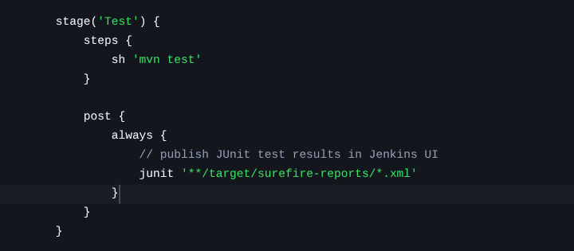{width=100%}

The Jenkins pipeline triggers the `mvn test` phase. This screenshot shows the pipeline in progress, specifically focusing on the test stage execution within the Jenkins UI.

### 8.2 Test Results Validation

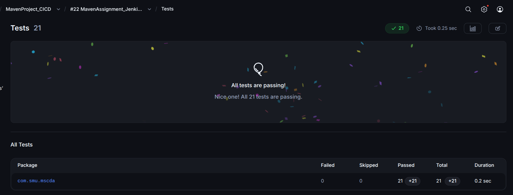{width=100%}

After the test stage completes, Jenkins captures the JUnit results. This screenshot confirms that all 21 tests passed successfully within the CI environment, ensuring code stability before packaging.

### 8.3 Packaging Phase

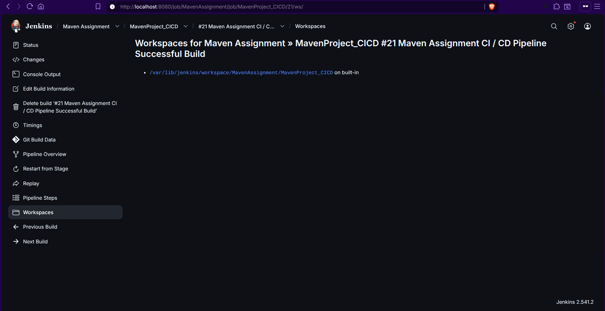{width=100%}

Once tests pass, the pipeline proceeds to the `Package` stage, running `mvn clean package`. This ensures that a clean, tested JAR artifact is generated automatically.

### 8.4 Build Success and Artifact Confirmation

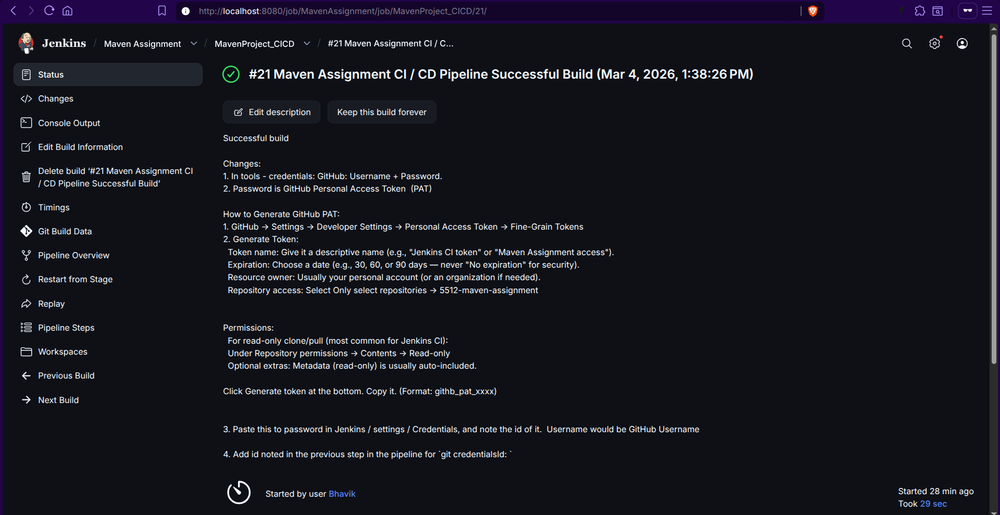{width=100%}

The final status of the pipeline shown as "Success". This indicates that every stage—Checkout, Verify Environment, Build, Test, and Package—was completed without errors.

### 8.5 Full Pipeline Visualization

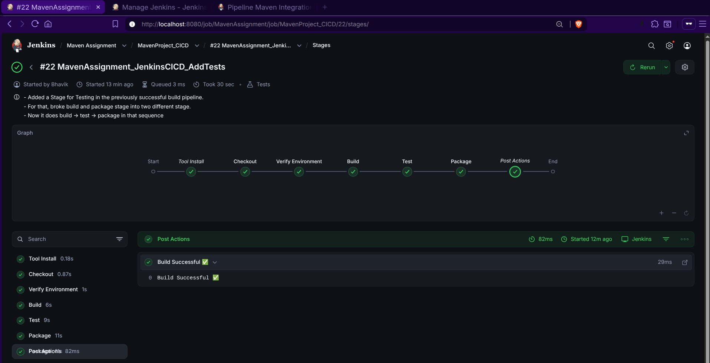{width=100%}

A comprehensive view of the Jenkins Stage View, showing the duration and status of each individual stage in the pipeline. This provides a clear audit trail of the automation process.

### 8.6 Execution Log Output

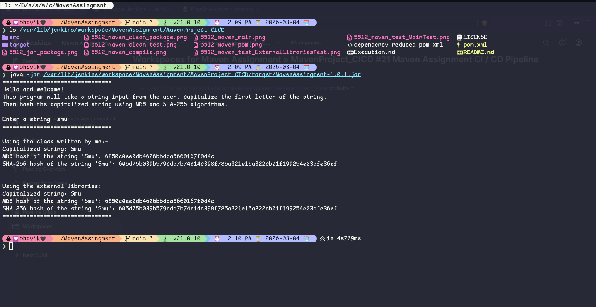{width=100%}

Detailed console output from the Jenkins build agent, showing the final Maven packaging logs and the "BUILD SUCCESS" message within the CI environment.

---

## Conclusion

The Maven build process, combined with automated Jenkins CI/CD pipelines, demonstrates a professional development workflow with:
- ✅ Automated build and test cycles  
- ✅ Continuous integration for multi-developer environments  
- ✅ Quality gate enforcement through Maven plugins  
- ✅ Reliable artifact generation and verification  

The project is fully optimized for automated delivery and maintenance.
